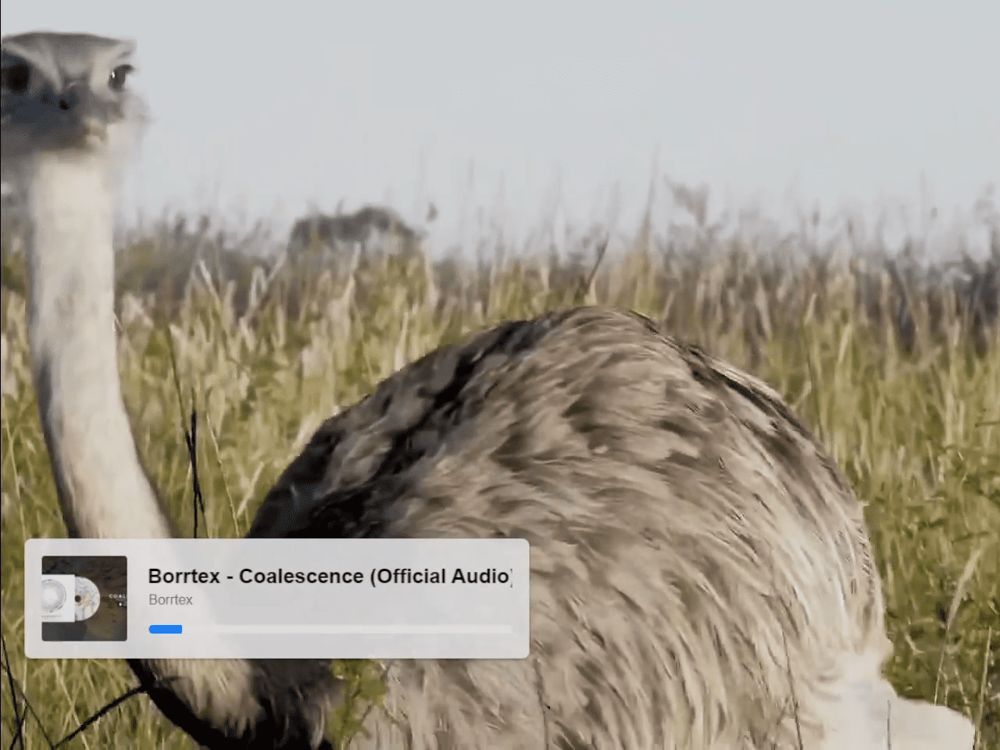
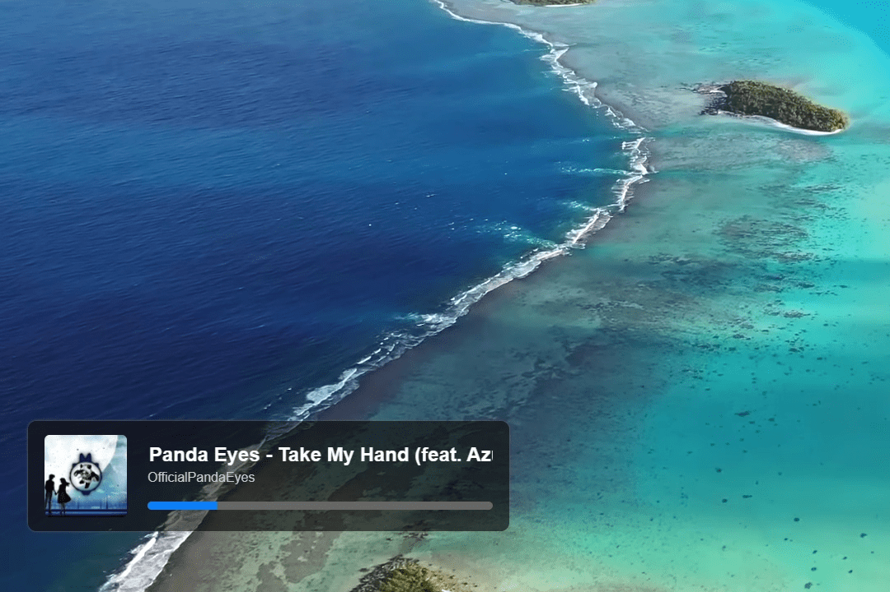
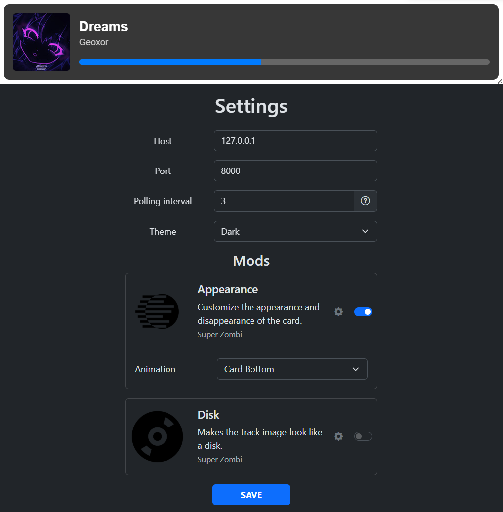

# Melody Monitor for OBS

    
    

### ⚠️Works only on Windows⚠️

## Installation
1. Download program from [Releases](https://github.com/SuperZombi/melody-monitor/releases).
2. Run `melody-monitor.exe` (The program will start in the tray).
3. Click `Open in Browser` and copy the link in your browser.
4. Add a new source in OBS (Browser).
5. Paste the copied link into the URL field.
6. Adjust the height and width of the element (recommended: height: 150px, width: 600px).
7. Check the box "Refresh browser when source becomes active".

## Settings

#### Host
Specify `0.0.0.0` if you want to open access to all computers on the local network.
#### Interval
How often the program will call the Windows API to update media data (seconds)

## Modifications
Create a `mods` folder next to the `melody-monitor.exe`. 
You can download community mods [here](mods).

#### 💲Donate

<table>
  <tr>
    <td>
       
    </td>
    <td>
      <a href="https://donatello.to/super_zombi">Donatello</a>
    </td>
  </tr>
  <tr>
    <td>
       
    </td>
    <td>
      <a href="https://www.donationalerts.com/r/super_zombi">Donation Alerts</a>
    </td>
  </tr>
</table>
