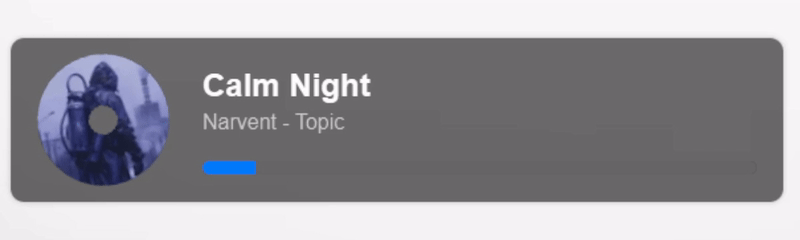

# Disk animation

### Author: [SuperZombi](https://github.com/SuperZombi)

### Installation:
1. Download [disk.css](disk.css)
2. Create a `mods` folder next to the `melody-monitor.exe`
3. Move `disk.css` to `mods` folder.
